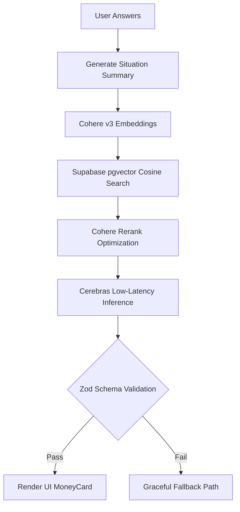

# <p align="center"></p>

<p align="center">
  
  
  
  
</p>

<p align="center">
  <strong>A benefits guidance tool powered by AI, built for the people who need it most.</strong>
</p>

<p align="center">
  <a href="https://clarity-ai-mu-topaz.vercel.app/"><strong>⚡ View Live Demo</strong></a> • 
  <a href="https://github.com/d3rd-dotcom/Clarity-AI"><strong>📦 Source Code</strong></a>
</p>

<p align="center">
  
  
  
</p>

---

## 🎯 The Core Thesis

### The Person Behind This Project
> **Meet Sarah:** A 28-year-old single mother of two in Manchester. She works part-time at a supermarket because childcare costs make full-time work financially impossible. She rents a flat. She has heard of *Universal Credit* but assumed she earns too much to qualify. She has never heard of *Child Benefit* as its own separate payment. **Nobody told her.**

Every year, stories like Sarah's repeat across the UK — and **£24.1 billion** in benefits go unclaimed as a result. Not because people are lazy, but because the system was never built for them.

### 📊 The Problem (Verified Data)
According to Policy in Practice's *Missing Out* report:
* **£24.1 Billion** in income-related benefits and social tariffs go unclaimed annually.
* **7+ Million** households are actively missing out on vital support.
* **£3,428 / Year** is the average amount an affected household leaves behind.

> 🗣️ *"It's not a failure of the public. It's a failure of a social security system that is still too complex, too fragmented and too passive."* > — **Deven Ghelani**, Director of Policy in Practice

---

## 🛠️ What Clarity Does

Clarity is a benefits guidance tool. It asks a short series of plain-language questions, identifies which benefits a person likely qualifies for, explains each one in plain English, and gives them a clear next step — **in under two minutes.** It does not replace GOV.UK; it makes it accessible.

### 📋 Intelligent Intake Wizard
The engine processes a 6-step dynamic form where the final question is conditionally injected to optimize user flow:

| # | Question | Why It Matters |
|---|---|---|
| **1** | What is your current work situation? | Determines Universal Credit and income-based eligibility |
| **2** | Who do you live with? | Determines household benefit combinations |
| **3** | What is your housing situation? | Determines Housing Benefit / housing element eligibility |
| **4** | How old are you? | Affects Pension Credit and age-based thresholds |
| **5** | Do you have a health condition or disability? | Determines PIP and Carer's Allowance eligibility |
| **6** | *How many dependent children do you have? (Conditional)* | Drives Child Benefit, Child Tax Credit, Free School Meals |

### 💎 The Output: The "MoneyCard" UI
After the evaluation, the user is presented with a clear structural summary:
* 💳 **The MoneyCard:** The signature UI element showing the estimated total monthly/weekly amount left unclaimed.
* 🚦 **Confidence Badges:** Every matched benefit receives a clear badge (`Strong match` / `Possible match` / `Complex case`).
* 🗺️ **Action Checklists:** Sourced, step-by-step guidance paired with an explicit **"Verify on GOV.UK"** outbound route.

---

## 🏗️ Technical Architecture

Clarity features a robust, type-safe architecture separating a high-performance Vue 3 frontend from an Express RAG pipeline.

```bash
.
├── backend/                # Express + TypeScript RAG pipeline (API)
│   ├── api/                # Production endpoints (assess, health, protected indexer)
│   ├── lib/                # Modular engine (embed, retrieve, generate, clients)
│   ├── data/benefits/      # Structured benefit schemas & eligibility guidelines
│   └── setup.sql           # Supabase vector configurations & HNSW indexing
└── frontend/               # Vue 3 + Vite SPA
    ├── components/         # Modular form wizards, dynamic MoneyCards, and UI kits
    └── stores/             # Pinia state machines managing intake logic
```

## 🚀 Quick Start

### Prerequisites
* Node.js (v20+)
* Supabase Account (with pgvector enabled)

### Local Development Setup

1. **Clone and Install Dependencies:**
   ```bash
   git clone https://github.com/codewithyash28/Clarity-AI.git
   cd Clarity-AI
   # Install dependencies for both backend and frontend
   cd backend && npm install
   cd ../frontend && npm install
   ```

2. **Environment Configuration:**
   Create a `.env` file inside the `backend/` directory:
   ```env
   PORT=5000
   SUPABASE_URL=your_supabase_url
   SUPABASE_KEY=your_supabase_anon_key
   COHERE_API_KEY=your_cohere_key
   CEREBRAS_API_KEY=your_cerebras_key
   GROQ_API_KEY=your_groq_key
   ```

3. **Run the Application:**
   ```bash
   # In one terminal:
   cd backend && npm run dev

   # In another terminal:
   cd frontend && npm run dev
   ```

---

### ⚙️ Production Technology Stack

| Layer | Technology | Purpose |
|---|---|---|
| **Frontend** | `Vue 3` + `TypeScript` + `Pinia` + `Vite` | State management, fast wizard execution |
| **Styling** | `Tailwind CSS v4` | Trustworthy, highly-accessible dark/warm design system |
| **Core API** | `Express` + `TypeScript` (`Node 20+`) | RAG orchestration, strict request validation |
| **Vector Engine** | `Supabase` + `pgvector` (`HNSW Index`) | Sub-millisecond similarity lookups |
| **Embeddings** | `Cohere embed-english-v3.0` | High-fidelity natural language vectorization |
| **Reranking** | `Cohere rerank-english-v3.0` | Semantic sorting of retrieved policy text |
| **Primary LLM** | `Cerebras (gpt-oss-120b)` | Ultra-low latency inference for live generation |
| **Fallback LLM** | `Groq (llama-3.3-70b-versatile)` | Automatic failover layer to guarantee system uptime |
| **Validation** | `Zod` | Structural schema runtime guards on all AI outputs |

---

## 🧠 Core RAG Pipeline Mechanics



1. **Context Extraction:** User responses are compiled into an explicit natural-language profile.
2. **Vector Matching:** Profiles are vectorized via `embed-english-v3.0` and matched against target UK policy blocks using `pgvector` utilizing an **HNSW index** for blazing-fast lookups.
3. **Low-Latency Logic:** The matched constraints pass directly to `Cerebras` to evaluate confidence, while `Groq` serves as an active fallback.
4. **Deterministic Validation:** The AI's JSON output must cleanly map to a strict runtime **Zod schema** before delivery, completely mitigating UI breakages from structural drift or hallucinations.
5. **Fail-Safe Integrity:** If any step in the pipeline hits an exception, the system gracefully serving one of three pre-verified regional profiles so the user never encounters a dead end.

### 🛡️ Implementation Highlight: Resilient Multi-LLM Failover Engine

Clarity ensures high availability by automatically failing over between Cerebras and Groq if the primary path encounters latency or API errors.

```typescript
export async function generateAssessment(
  situationText: string,
  chunks: BenefitChunk[]
): Promise<AssessmentResult> {
  // Primary Path: Cerebras (Ultra-Low Latency)
  try {
    const raw = await callLLM({
      baseUrl: "https://api.cerebras.ai/v1",
      model: "gpt-oss-120b",
      // ... configuration
    });
    return parseAssessmentJSON(raw);
  } catch (err) {
    console.warn("Cerebras failed, initiating failover to Groq...");

    // Automatic Fallback Path: Groq
    const raw = await callLLM({
      baseUrl: "https://api.groq.com/openai/v1",
      model: "llama-3.3-70b-versatile",
      // ... configuration
    });
    return parseAssessmentJSON(raw);
  }
}
```

---

## ⚖️ Responsible AI & Compliance

* 🔒 **Zero Native Data Retention:** To maximize user trust and satisfy **UK GDPR** regulations regarding special-category data, no personal health, demographic, or income data is stored or logged. Data exists strictly within the ephemeral client session.
* 🛑 **Authority Decoupling:** The AI is strictly sandboxed via system prompts to prevent it from declaring official legal eligibility. The interface maintains clear `"Verify with GOV.UK"` hooks for every calculation.
* 🛡️ **Edge-Case Safety:** Complex configurations (e.g., non-standard immigration status or highly unique household structures) bypass predictive modeling and are safely flagged as `Needs Review` to prevent misclassification.
* ⚡ **Production Hardening:** Locked down via target CORS allowlisting, rigorous rate-limiting, Helmet HTTP headers, and strict `npm audit` gates inside the CI/CD pipeline.

---

## 📈 Future Vision & Roadmap

* [ ] **Real-Time Data Pipelines:** Replace static structured JSON policy logs with an automated scraper tied directly to the live GOV.UK API.
* [ ] **Geographic Scaling:** Expand rule evaluations to support localized variations across Scotland, Wales, and Northern Ireland.
* [ ] **Human-in-the-Loop Integrations:** Build secure handoff channels to Citizens Advice specialists for cases flagged as structurally complex.

---

## 👥 The Team: FluxCore

* **Product & Pitch Strategy:** Problem Space Analysis, UX Layouts, AI Safety Compliance Narrative.
* **Technical Lead:** RAG System Design, Core LLM Orchestration, Vue Application State, Deployment Setup.

---

<p align="center">
<i>Clarity is not an AI automation tool. It is a benefits guidance tool, powered by AI. The difference matters.</i>
</p>
